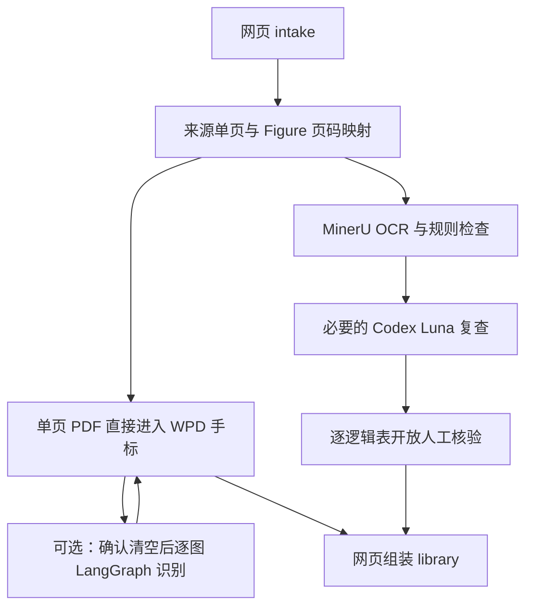

# 架构与产物

## 处理边界



同一物理页可以同时含 Figure 和 Table；混合页进入两条支线。跨页表的片段在表格支线内归并，人工核验的单位是完整逻辑表。Luna 仍由 Codex 主代理派发 `gpt-6-luna`、`xhigh`，网页不运行额外代理调度器。

## 固定文件布局

```text
pdfs/<手册>.pdf
figure_assets/<手册>/
  _page_review/page_####.pdf
  Figure_<编号>/Figure_<编号>.pdf
  Figure_<编号>/Figure_<编号>.tar       # 当前可编辑版本
runs/<手册>/
  manual.json                          # schema 2；来源版本、Figure 页码、异常
  intake/evidence/                      # 页面文字与必要的本地 OCR 证据
  tasks/<操作>.json                     # 每个操作一份当前状态
  figures/Figure_<编号>/
    status.json
    model/                             # 输入引用、渲染、计划、模型尝试、TAR 种子
    checkpoint.sqlite                  # 中断时保留，完成后移除
    review.json                        # 当前 TAR 的人工状态
  tables/
    manifest.json                      # schema 2；节点及来源页定位
    segments.json
    segments/                          # 实际送入 MinerU 的连续页 PDF
    ocr/<段>/                          # OCR 内容和服务响应证据
    index.json                         # 简短索引，内容真源为各 candidate.json
    luna_batch_plan.json
    luna_batches/
      LUNA_TABLE_REVIEW_CONTRACT.md     # 本次合同快照
      pages/page_####.png               # 每个来源页只渲染一次
      batch_###/input_manifest.json
      batch_###/output/                 # Luna 补丁与报告
    Table_<编号>/                      # 无编号表使用稳定业务替代编号
      candidate.json                   # schema 2 + revision
      table.xlsx
      table_provenance.json
      notes.md
      candidate_preview.png
      review_request.json              # 仅需 Luna 的表提供精简输入
      luna_patch.json                  # 有 Luna 结果时存在
      human_review.json                # 人工旧值/新值、来源页、确认状态
library/<手册>/                        # 可重建成品
```

组件暂时分开解析时使用同一 `tables/` 下的固定 `Table_*_part_###` 位置，合并后删去被吸收的组件目录。工作目录不按 `review_required`、`final` 等状态复制。来源 PDF 从共享 `_page_review/` 读取，不为每张候选再复制一套。最终成品自身携带来源页，以便独立使用。

## 保存与并发

- `manual.json` 是 intake 的唯一公开协议，两条支线只读；用文件大小和修改时间检测来源 PDF 被替换，不建立文件哈希清单。
- 同手册保留图像、表格、发布操作系统文件锁；每个 Figure 另有独立锁，网页识别任务与该图人工保存互斥，不同 Figure 可以并行。intake、组装、整册图像处理获取所有 Figure 锁，避免与单图识别交叉写入。进程退出自动释放锁，遗留运行状态显示为中断。
- Table 候选使用递增 `revision`，人工修订记录 `base_revision` 和保存版本。源候选变动、另一窗口保存或单元格旧值不符时拒绝覆盖。
- Figure 保存通过 TAR 的大小与纳秒修改时间检查版本，核对 TAR 内来源图像未被替换后原子保存。首次手标保存以原始单页 PDF 为来源校验。Codex 默认模型重试只更新种子和诊断；网页单图识别经明确清空确认后先写入空白 PDF 项目、使旧保存版本失效，成功后以模型 TAR 替换。失败时仍可继续手标。
- Luna 批次可分次应用；待合并的同编号组件尚未全部就绪时不开放该逻辑表。重复应用不重复修改内容，逐页公式检查摘要保留。
- 组装先生成临时成品，再替换当前成品；失败时保留上一版。

## Hardcut

仅支持 `materials-workbench` 命令行入口、上述目录、schema 2 手册/候选/人工记录以及 Luna 合同 2.0。原 `chart-annotator`、`table-workflow`、`build-pdf-tree` 命令及旧 manifest/状态目录不提供兼容。已迁入的既有资产是一次性转换结果，运行时不包含迁移层。

算法代码来自图像项目 `95c2813` 与表格项目 `8b3d0cb`；保留核心算法和对应回归测试。WPD 5.3 固定为官方提交 `3a3ecb11606945d0701c8a488777e6861be70056`，来源和许可证见 `vendor/wpd/SOURCE.md`。WPD 自己的 TAR 数据版本仍为 `[4, 2]`，属于该第三方应用的原生格式。
